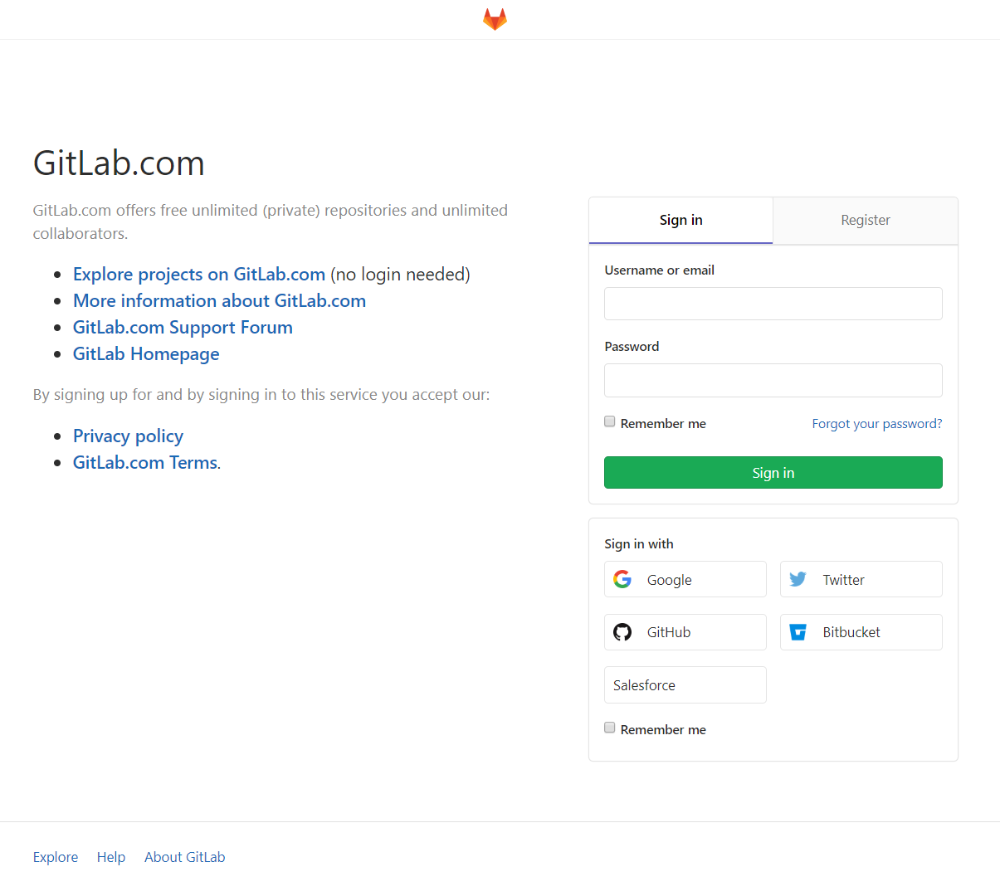
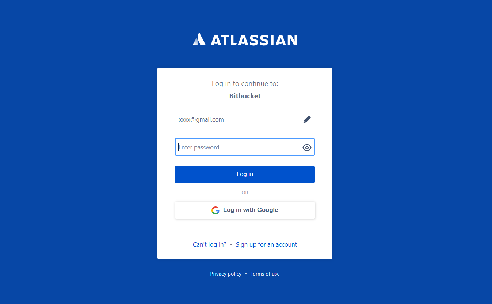
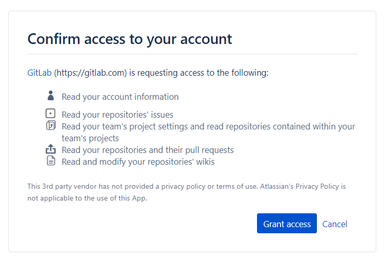
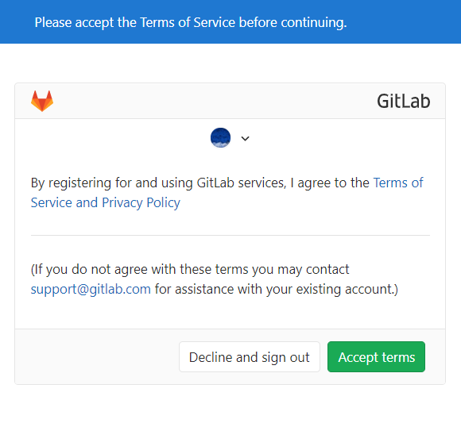
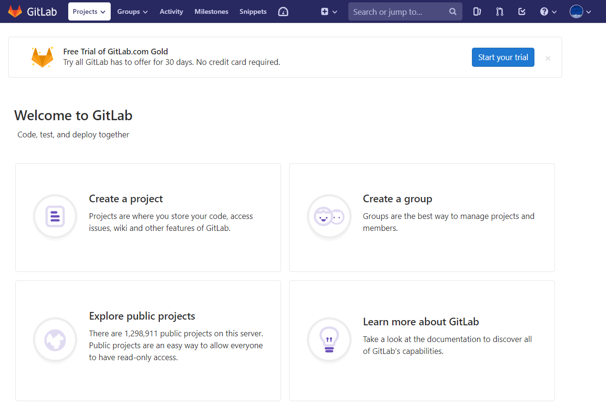

<h2>Login Screen</h2>

<h2>Redirect to github page with parameter</h2>

https://github.com/login? client_id=xxxxxxxxxxxxxxxxxxxxxx &return_to=/login/oauth/authorize?client_id=xxxxxxxxxxxxxxxxxxxxxx&redirect_uri=https://gitlab.com/users/auth/github/callback&response_type=codescope=user:email&state=.........................

<h2>Review Permission</h2>

<h2>Term of service</h2>

<h2>Retun to git lab</h2>

