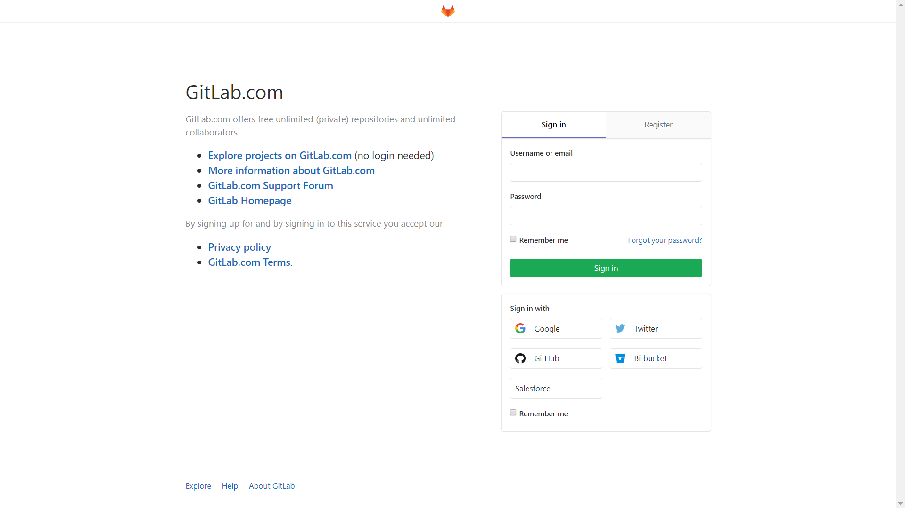
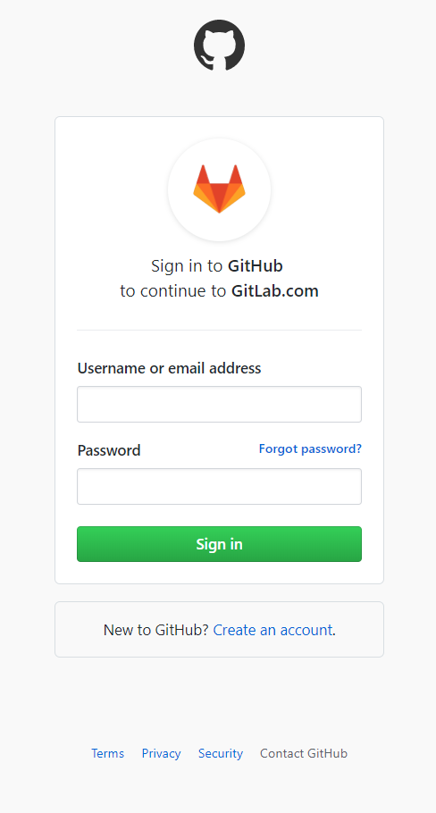
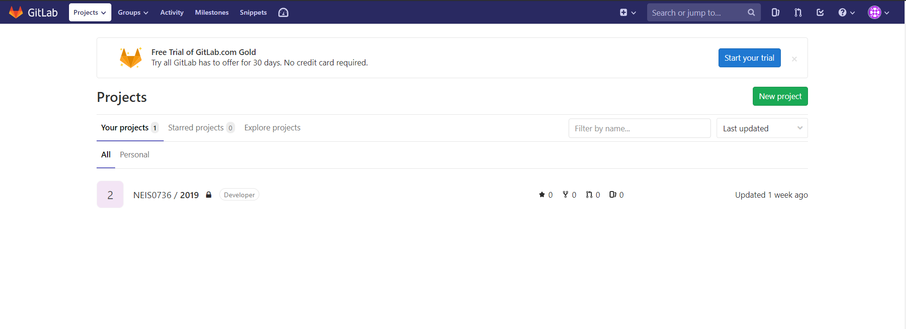

https://github.com/login? 

client_id=xxxxxxxxxxxxxxxxxxxxxx 

return_to=/login/oauth/authorize?

client_id=xxxxxxxxxxxxxxxxxxxxxx
redirect_uri=https://gitlab.com/users/auth/github/callback
response_type=code
scope=user:email
state=.........................

